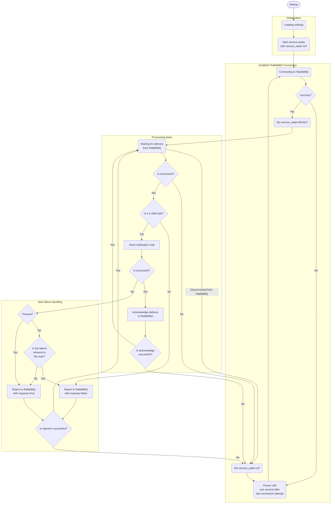

# SMTP-Mailer State Diagram

```mermaid

flowchart TB
    startup([Startup])
    loading_settings(Loading settings)
    start_service_probe(Start service probe<br>with service_state=UP)
    connecting_to_rabbitmq(Connecting to RabbitMQ)
    is_rabbitmq_connection_successful{Success?}
    pause_before_reconnect(Pause until<br>one second after<br>last connection attempt)
    set_to_ready(Set service_state=READY)
    set_to_up(Set service_state=UP)
    waiting_for_delivery(Waiting for delivery<br>from RabbitMQ)
    is_successful_delivery{Is successful?}
    is_valid_task{Is it a valid task?}
    reject_without_requeue[Reject to RabbitMQ<br>with requeue=false]
    is_reject_successful{Is rejection successful?}
    send_notification_mail[Send notification mail]
    is_mail_send_successful{Is successful?}
    is_failure_inherent_to_task{Is the failure<br>inherent to<br>the task?}
    reject_with_requeue[Reject to RabbitMQ<br>with requeue=true]
    is_mail_send_timed_out{Timeout?}
    acknowledge_delivery[Acknowledge delivery<br>to RabbitMQ]
    is_acknowledge_successful{Is acknowledge<br>successful?}

    startup --> loading_settings
    loading_settings --> start_service_probe
    start_service_probe --> connecting_to_rabbitmq
    connecting_to_rabbitmq --> is_rabbitmq_connection_successful
    is_rabbitmq_connection_successful -- No --> pause_before_reconnect
    pause_before_reconnect --> connecting_to_rabbitmq
    is_rabbitmq_connection_successful -- Yes --> set_to_ready
    set_to_ready --> waiting_for_delivery
    waiting_for_delivery -- Disconnected from RabbitMQ --> set_to_up
    set_to_up --> pause_before_reconnect
    waiting_for_delivery --> is_successful_delivery
    is_successful_delivery -- No --> set_to_up
    is_successful_delivery -- Yes --> is_valid_task
    is_valid_task -- No --> reject_without_requeue
    is_valid_task -- Yes --> send_notification_mail
    send_notification_mail --> is_mail_send_successful
    is_mail_send_successful -- Yes --> acknowledge_delivery
    acknowledge_delivery --> is_acknowledge_successful
    is_acknowledge_successful -- No --> set_to_up
    is_acknowledge_successful -- Yes --> waiting_for_delivery
    is_mail_send_successful -- No --> is_mail_send_timed_out
    is_mail_send_timed_out -- No --> is_failure_inherent_to_task
    is_mail_send_timed_out -- Yes --> reject_with_requeue
    reject_without_requeue --> is_reject_successful
    is_reject_successful -- No --> set_to_up
    is_reject_successful -- Yes --> waiting_for_delivery
    is_failure_inherent_to_task -- Yes --> reject_without_requeue
    is_failure_inherent_to_task -- No --> reject_with_requeue
    reject_with_requeue --> is_reject_successful

    subgraph init [Iniitialization]
        loading_settings
        start_service_probe
    end

    subgraph establish_rabbitmq_connection [Establish RabbitMQ Connection]
        connecting_to_rabbitmq
        is_rabbitmq_connection_successful
        pause_before_reconnect
        set_to_up
        set_to_ready
    end

    subgraph processing_tasks [Processing tasks]
        waiting_for_delivery
        is_successful_delivery
        is_valid_task
        send_notification_mail
        is_mail_send_successful
        acknowledge_delivery
        is_acknowledge_successful
    end

    subgraph task_failure_handling [Task failure handling]
        reject_without_requeue
        reject_with_requeue
        is_failure_inherent_to_task
        is_mail_send_timed_out
        is_reject_successful
    end
```
